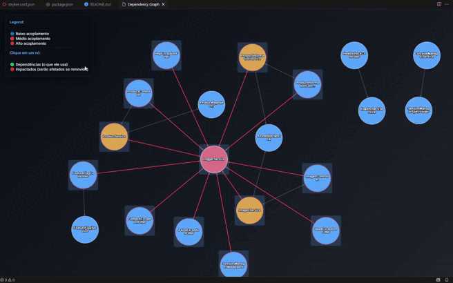
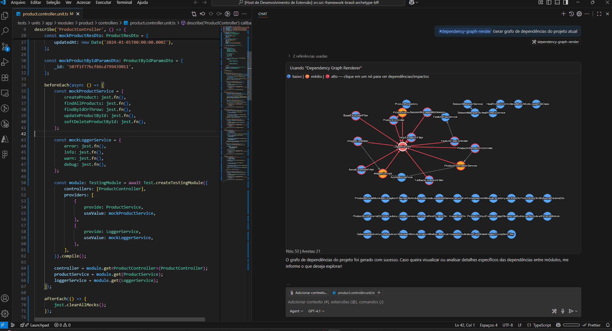

# Dependency Graph - VSCode Extension

[](https://marketplace.visualstudio.com/items?itemName=joaoferreira981011.vscode-dependency-graph)
[](https://marketplace.visualstudio.com/items?itemName=joaoferreira981011.vscode-dependency-graph)
[](https://marketplace.visualstudio.com/items?itemName=joaoferreira981011.vscode-dependency-graph)

## 📊 Visualize suas dependências como nunca antes

**Dependency Graph** é uma extensão poderosa para Visual Studio Code que transforma a complexidade das dependências do seu código em visualizações interativas e intuitivas. Ideal para projetos que utilizam **NestJS**, **Inversify**, **Awilix** ou qualquer arquitetura baseada em injeção de dependências.



## ✨ Principais Recursos

### 🎯 **Análise Inteligente**

- Detecta automaticamente classes e suas dependências
- Suporte nativo para decoradores `@inject`, `@Injectable`, `@Inject`
- Análise de interfaces e suas implementações
- Identificação de dependências em construtores e propriedades

### 🎨 **Visualização Interativa**

- **Grafo interativo** com navegação fluida
- **Código de cores inteligente**:
  - 🔵 Baixo acoplamento (1-2 dependências)
  - 🟠 Médio acoplamento (3-5 dependências)
  - 🔴 Alto acoplamento (6+ dependências)
- **Modo de análise de impacto**: Clique em qualquer nó para ver:
  - 🟢 Dependências diretas (o que o módulo usa)
  - 🔴 Módulos impactados (o que seria afetado se removido)

### ⚡ **Performance e Usabilidade**

- Análise em tempo real de projetos TypeScript
- Interface responsiva com zoom e pan
- Tooltips informativos com métricas detalhadas
- Atalhos de teclado para navegação rápida

## 🚀 Como Usar

### Instalação

1. Abra o Visual Studio Code
2. Vá para a aba Extensions (`Ctrl+Shift+X`)
3. Procure por "Dependency Graph"
4. Clique em "Install"

### Uso Básico

1. Abra um projeto TypeScript com `tsconfig.json`
2. Pressione `Ctrl+Shift+P` para abrir o Command Palette
3. Digite "Show Dependency Graph" e pressione Enter
4. Navegue pelo grafo interativo das suas dependências

### Atalhos de Teclado

- **`+` / `=`**: Zoom in
- **`-`**: Zoom out
- **`R`**: Reset da visualização
- **`Esc`**: Limpar seleções
- **Click no nó**: Analisar impacto
- **Click no fundo**: Limpar análise

## 🤖 Uso com IA (Copilot Chat)




Agora você também pode gerar e visualizar o grafo direto no Copilot Chat usando a ferramenta de IA integrada da extensão.

### Pré‑requisitos (IA)

- VS Code 1.103.0 ou superior (preferencialmente Insiders) com Chat habilitado
- GitHub Copilot Chat instalado e autenticado

### Como usar no Copilot Chat

1. Abra o painel do Copilot Chat
2. No chat, peça para gerar o grafo usando a ferramenta por nome. Exemplos de prompts:
  - “Use a ferramenta dependency-graph-render para gerar o grafo de dependências do workspace atual.”
  - “Gere e mostre o grafo de dependências (dependency-graph-render).”
  - “dependency-graph-render”
3. Opcionalmente, informe a raiz do workspace (se não quiser usar a primeira pasta aberta):

  Exemplo de prompt com parâmetro:
  - “Use a ferramenta dependency-graph-render com { "workspaceRoot": "C:\\caminho\\do\\projeto" }”

Se tudo estiver correto, o Copilot retornará uma mensagem “Dependency graph generated” seguida de um bloco visual interativo do grafo dentro do próprio chat. Você poderá:

- Clicar nos nós para ver dependências e impactados
- Usar “+”/“-” para zoom, “R” para reset
- Pressionar “Esc” para limpar destaques

Observações:

- A ferramenta lê os arquivos do workspace para calcular o grafo (não requer configuração adicional além do seu projeto TypeScript com tsconfig.json).
- Caso sua versão do VS Code não suporte renderização de “Chat Output” ainda, o chat pode não exibir o grafo visual. Use o comando “Show Dependency Graph” pelo Command Palette como alternativa.
- Se você vir mensagens como “vscode.lm API indisponível”, atualize o VS Code e garanta que o Copilot Chat está ativo.

## 🏗️ Frameworks Suportados

### NestJS

```typescript
@Injectable()
export class UserService {
  constructor(
    @Inject("DATABASE_CONNECTION") private db: DatabaseConnection,
    private emailService: EmailService
  ) {}
}
```

### Inversify

```typescript
@injectable()
export class UserService {
  constructor(
    @inject("DatabaseService") private db: DatabaseService,
    @inject("EmailService") private emailService: EmailService
  ) {}
}
```

### Awilix / Manual DI

```typescript
export class UserService {
  constructor(
    private databaseService: DatabaseService,
    private emailService: EmailService
  ) {}
}
```

## 📈 Casos de Uso

### 🔍 **Análise de Arquitetura**

- Identifique módulos com alto acoplamento
- Visualize a estrutura geral do seu sistema
- Detecte dependências circulares

### 🛠️ **Refatoração Segura**

- Veja o impacto antes de remover um módulo
- Identifique oportunidades de simplificação
- Planeje mudanças arquiteturais

### 📚 **Documentação Visual**

- Gere documentação visual automática
- Facilite onboarding de novos desenvolvedores
- Compartilhe insights sobre a arquitetura

### 🧪 **Code Review**

- Analise o impacto de mudanças em PRs
- Verifique se novos módulos seguem boas práticas
- Identifique over-engineering

## 📋 Pré-requisitos

- **Visual Studio Code** 1.96.0 ou superior
- **Projeto TypeScript** com `tsconfig.json` configurado
- **Node.js** para projetos com dependências npm

## ⚙️ Configuração

A extensão funciona out-of-the-box, mas você pode personalizar:

```json
{
  "dependencyGraph.autoAnalyze": true,
  "dependencyGraph.maxNodes": 100,
  "dependencyGraph.showInterfaces": true
}
```

## 🎯 Métricas Suportadas

Para cada módulo, a extensão calcula:

- **In-degree**: Quantos módulos dependem dele
- **Out-degree**: De quantos módulos ele depende
- **Impacto**: Quantos módulos seriam afetados se removido
- **Complexidade**: Score baseado no total de conexões

## 🔧 Solução de Problemas

### Grafo não aparece?

- ✅ Verifique se existe um `tsconfig.json` na raiz
- ✅ Confirme que há classes TypeScript no projeto
- ✅ Verifique o console de desenvolvedores (`F12`)

### Performance lenta?

- ⚡ Projetos com 100+ classes podem demorar alguns segundos
- ⚡ Consider excluir `node_modules` do `tsconfig.json`

### Dependências não detectadas?

- 🔍 Verifique se os decorators estão habilitados no `tsconfig.json`
- 🔍 Confirme que as dependências são injetadas via construtor

### Como contribuir:

1. Fork o repositório
2. Crie uma branch para sua feature (`git checkout -b feature/AmazingFeature`)
3. Commit suas mudanças (`git commit -m 'Add some AmazingFeature'`)
4. Push para a branch (`git push origin feature/AmazingFeature`)
5. Abra um Pull Request

## 👨‍💻 Autor

**João Luiz Pereira Ferreira**

- Email: joaoferreira981011@gmail.com
- GitHub: [@11jl98](https://github.com/11jl98)

## 📊 Status do Projeto


---

**🌟 Se esta extensão te ajudou, considere dar uma estrela no repositório!**

[](https://marketplace.visualstudio.com/items?itemName=joaoferreira981011.vscode-dependency-graph&ssr=false#review-details)
